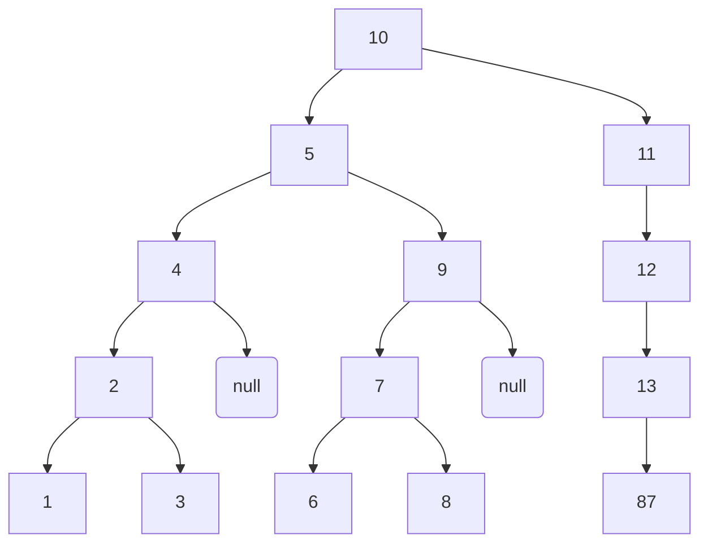
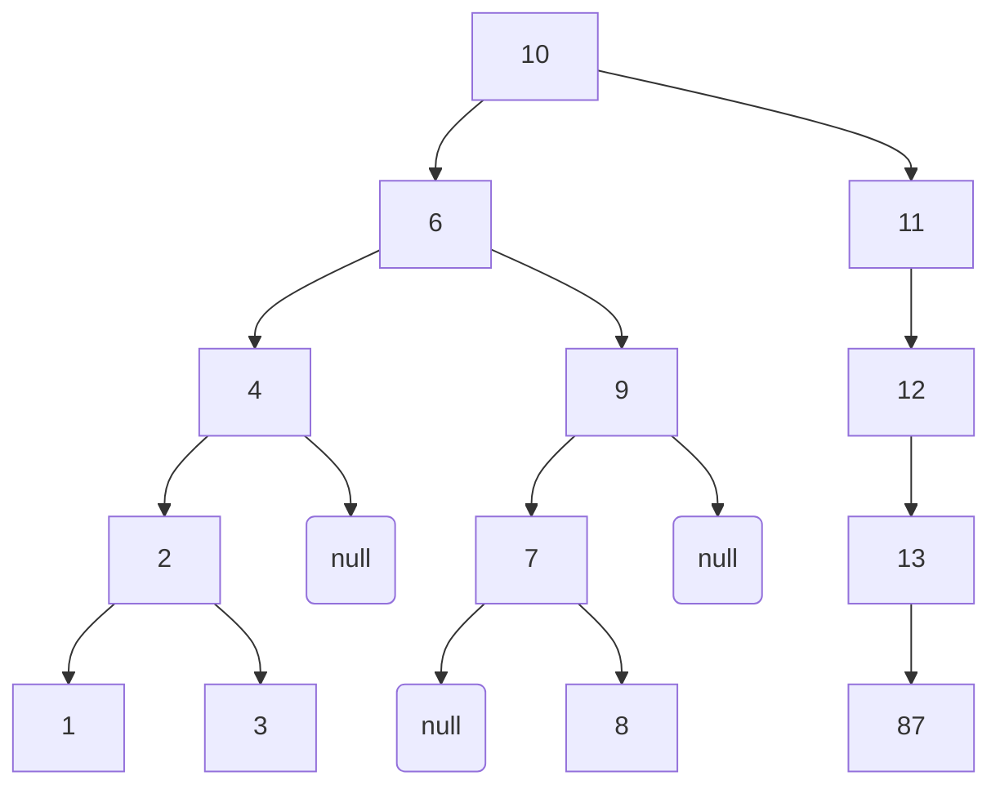

## js处理二叉树数据结构
 

 ### 参考
* 慕课网.coding迪斯尼.二叉树算法原理及代码实现  [链接](https://www.imooc.com/video/15739)

 ### 代码
 ```javascript
        // 二叉树构造函数
        var BinaryTreeGenerator = function () {
            var NodeGenerator = function (value) {
                this.value = value;
                this.left = null;
                this.right = null;
            }
            this.root = null;
            var insertNode = function (oldNode, newNode) {
                if (newNode.value < oldNode.value) {
                    if (oldNode.left === null) {
                        oldNode.left = newNode;
                    } else {
                        insertNode(oldNode.left, newNode);
                    }
                } else if (newNode.value > oldNode.value) {
                    if (oldNode.right === null) {
                        oldNode.right = newNode
                    } else {
                        insertNode(oldNode.right, newNode)
                    }
                }
            }
            this.insert = function (value) {
                var newNode = new NodeGenerator(value)
                if (this.root === null) {
                    this.root = newNode;
                } else {
                    insertNode(this.root, newNode);
                }
            }


            /** --------------------中序遍历----------------------- start */
            function middleTraversalNode(node, callback) {
                if (node.left) {
                    middleTraversalNode(node.left, callback)
                }
                callback && callback(node.value);
                if (node.right) {
                    middleTraversalNode(node.right, callback);
                }
            }
            this.middleTraversal = function (callback) {
                if (this.root.left) {
                    middleTraversalNode(this.root.left, callback)
                }
                callback && callback(this.root.value)
                if (this.root.right) {
                    middleTraversalNode(this.root.right, callback)
                }
            }

            /** --------------------中序遍历----------------------- end */

            /** --------------------前序遍历----------------------- start */
            var frountTraversalNode = function (node, callback) {
                if (node) {
                    callback(node.value)
                    frountTraversalNode(node.left, callback)
                    frountTraversalNode(node.right, callback)
                }
            }
            this.frountTraversal = function (callback) {
                frountTraversalNode(this.root, callback)
            }
            /** --------------------前序遍历----------------------- end */

            /** --------------------后序遍历----------------------- start */

            var backTraversalNode = function (node, callback) {
                if (node) {
                    backTraversalNode(node.left, callback);
                    backTraversalNode(node.right, callback);
                    callback(node.value);
                }
            }
            this.backTraversal = function (callback) {
                backTraversalNode(this.root, callback)
            }
            /** --------------------后序遍历----------------------- end */

            /** --------------------查询遍历----------------------- start */
            /** 找最小值 */
            var searchMin = function (node) {
                if (node) {
                    while (node && node.left) {
                        node = node.left;
                    }
                    return node.value;
                }
                return null;
            }
            this.findMin = function () {
                return searchMin(this.root)
            }
            /** 找最大值 */
            var searchMax = function (node) {
                if (node) {
                    while (node && node.right) {
                        node = node.right;
                    }
                    return node.value;
                }
                return false;
            }
            this.findMax = function () {
                return searchMax(this.root)
            }

            /** 查询值 */
            searchValue = (node, targetValue) => {
                if (node) {
                    if (node.value === targetValue) {
                        return true;
                    } else if (targetValue < node.value) {
                        return searchValue(node.left, targetValue);
                    } else {
                        return searchValue(node.right, targetValue);
                    }
                }
                return false;
            }
            this.findValue = function (targetValue) {
                return searchValue(this.root, targetValue);
            }
            /** --------------------查询遍历----------------------- end */
            /** --------------------删除遍历----------------------- end */
            var removeNode = function (node, targetValue) {
                if (!node) {
                    console.error('要删除的节点不存在')
                }
                if (targetValue < node.value) {
                    node.left = removeNode(node.left, targetValue);
                    return node
                } else if (targetValue > node.value) {
                    node.right = removeNode(node.right, targetValue);
                    return node
                } else {
                    if (!node.left && !node.right) { // 叶子节点
                        return null;
                    } else if (node.left && !node.right) { // 只有左节点
                        return node.left;
                    } else if (!node.left && node.right) { // 只有右节点
                        return node.right;
                    } else {
                        var rightMin = searchMin(node.right);
                        removeNode(node, rightMin)
                        node.value = rightMin;
                        return node;
                    }
                }
            }

            this.remove = function (targetValue) {
                this.root = removeNode(this.root, targetValue)
            }
            /** --------------------删除遍历----------------------- end */
        }


        // 生成二叉树实例
        var tree = new BinaryTreeGenerator();
        var arr = [10, 5, 11, 9, 7, 8, 6, 12, 13, 87, 4, 2, 3, 1];
        arr.forEach(function (item) {
            tree.insert(item);
        });

        //  二叉树中序遍历

        tree.middleTraversal(function (i) {
            console.log('中序遍历:', i);
        })

        // 二叉树前序遍历

        tree.frountTraversal(function (i) {
            console.log('前序遍历:', i);
        })

        // 二叉树后序遍历
        tree.backTraversal(function (i) {
            console.log('后序遍历:', i);
        })

        // 二叉树最小值
        var min = tree.findMin();
        console.log('二叉树的最小值是: ', min)

        // 二叉树最大值
        var max = tree.findMax();
        console.log('二叉树的最大值是: ', max)


        // 二叉树查询值
        console.log('二叉树中查询6的结果是: ', tree.findValue(6));
        console.log('二叉树中查询7的结果是: ', tree.findValue(7));

        // 二叉树删除节点
        // tree.remove(1)
        // tree.remove(4)
        // tree.remove(12)
        // tree.remove(5)
        console.log('tree', tree)

 ```

### 理解配图

#### 生成的二叉树
<i>只显示容易产生歧义的null节点</i>


#### 删除节点“5” 后的二叉树



